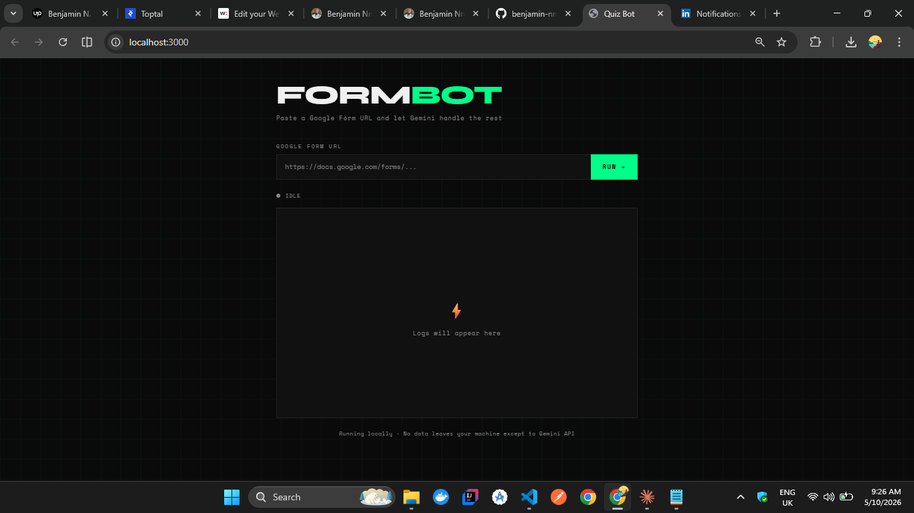
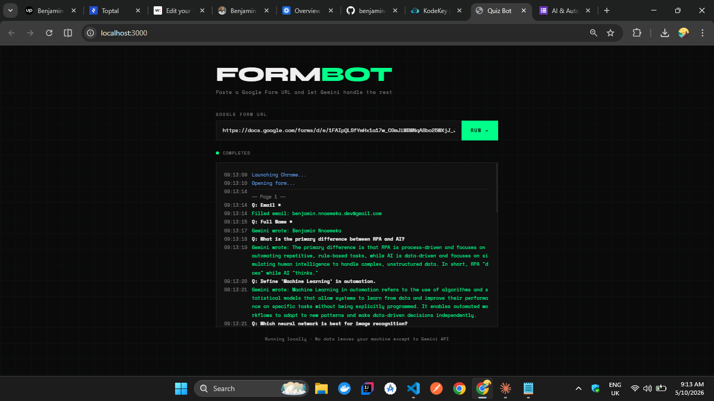

# form-bot

A browser automation tool that fills and submits Google Forms using Playwright and an AI model (Gemini) via an OpenAI-compatible client. Paste a form URL, click Run, and watch it work in real time.

  

| Idle | Running |
| --- | --- |
|  |  |

## What it does

- Opens Google Forms in a real Chrome browser
- Detects question types: multiple choice, short answer, paragraph
- Uses a Gemini model (`google/gemini-3-flash-preview`) to answer questions
- Autofills personal info (email, phone) automatically
- Streams live logs to the browser as it runs
- Strips common automation flags to reduce bot detection

## Tech Stack

- **Playwright** — browser automation
- **OpenAI-compatible client** — talks to a Gemini model (`google/gemini-3-flash-preview`)
- **Express** — local web server
- **Server-Sent Events** — real-time log streaming to the UI

## Setup

1. **Install dependencies**

Using pnpm:
```bash
pnpm install
pnpm exec playwright install chromium
```

Or npm:
```bash
npm install
npx playwright install chromium
```

2. **Configure environment variables**

Create a `.env` file in the project root:
```
GEMINI_API_KEY=your_gemini_api_key_here
BASE_URL=https://generativelanguage.googleapis.com/openai/
```

3. **Update `server.js` configuration**

Edit `server.js` and update the following variables with your actual values:

```js
// Update the profile directory path for your system
const DEDICATED_PROFILE_DIR = "C:\\Users\\YOUR_USERNAME\\AppData\\Local\\PlaywrightQuizProfile";

// Update your personal information (auto-filled in forms)
const PERSONAL_INFO = {
    email: "your.email@example.com",
    fullName: "Your Full Name",
    phone: "+0000000000",
};
```

4. **Run the server**

Development (with auto-reload):
```bash
pnpm dev
```

Or production:
```bash
node server.js
```

5. **Access the UI**

Open your browser and navigate to:
```
http://localhost:3000
```

On first run, a Chrome window will open for you to sign in to Google. The script uses a persistent profile directory, so subsequent runs will use your authenticated session and go straight to the form.

## How It Works

1. Express serves the frontend and exposes a `/run` endpoint
2. The frontend sends the form URL and opens an SSE connection for live logs
3. Playwright launches a persistent Chrome context with automation flags stripped
4. The script scans the form for `[role="listitem"]` and `[role="heading"]` elements
5. For each question it detects the input type and either autofills or asks the AI model
6. The model response is used to fill inputs or choose options
7. Logs stream back to the browser in real time via SSE

## Project Structure

```
form-bot/
├── server.js       # Express server + Playwright automation (update profile & personal info here)
├── index.html      # Frontend UI
├── .env            # API key (not committed)
├── .gitignore
└── package.json
```

## License

[MIT License](LICENSE) - free to use, modify and distribute.