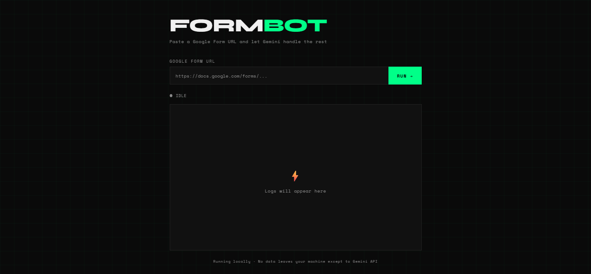

# form-bot

A browser automation tool that fills and submits Google Forms using Playwright and Gemini 2.5 Flash. Paste a form URL, click Run, and watch it work in real time.

  



## What it does

- Opens Google Forms in a real Chrome browser
- Detects question types: multiple choice, short answer, paragraph
- Uses Gemini AI to answer questions intelligently
- Autofills personal info (email, phone) automatically
- Streams live logs to the browser as it runs
- Bypasses Google's bot detection by disabling automation flags

## Tech Stack

- **Playwright** — browser automation
- **Gemini 2.5 Flash** — AI question answering
- **Express** — local web server
- **Server-Sent Events** — real-time log streaming to the UI

## Setup

**1. Clone the repo**
```bash
git clone https://github.com/benjamin-nnaemeka-dev/form-bot.git
cd form-bot
```

**2. Install dependencies**
```bash
pnpm add express playwright @google/generative-ai dotenv
pnpm playwright install chromium
```

**3. Create a `.env` file**
```
GEMINI_API_KEY=your_gemini_api_key_here
```

**4. Update your profile path and personal info in `server.js`**
```js
const DEDICATED_PROFILE_DIR = "C:\\Users\\YOUR_USERNAME\\AppData\\Local\\PlaywrightQuizProfile";
```

**5. Run the server**
```bash
node server.js
```

**6. Open your browser**
```
http://localhost:3000
```

## First Time Use

On first run Chrome will open fresh. Sign in to your Google account manually. Google will allow it because automation flags are disabled. After signing in, every future run goes straight to the form automatically.

## How It Works

1. Express serves the frontend and exposes a `/run` endpoint
2. The frontend sends the form URL and opens an SSE connection for live logs
3. Playwright launches a persistent Chrome context with automation flags stripped
4. The script scans the form for `[role="listitem"]` and `[role="heading"]` elements
5. For each question it detects the input type and either autofills or asks Gemini
6. Gemini responds intelligently based on the question context
7. Logs stream back to the browser in real time via SSE

## Project Structure

```
form-bot/
├── server.js       # Express server + Playwright automation
├── index.html      # Frontend UI
├── .env            # API key (not committed)
├── .gitignore
└── package.json
```

## License

[MIT License](LICENSE) - free to use, modify and distribute.